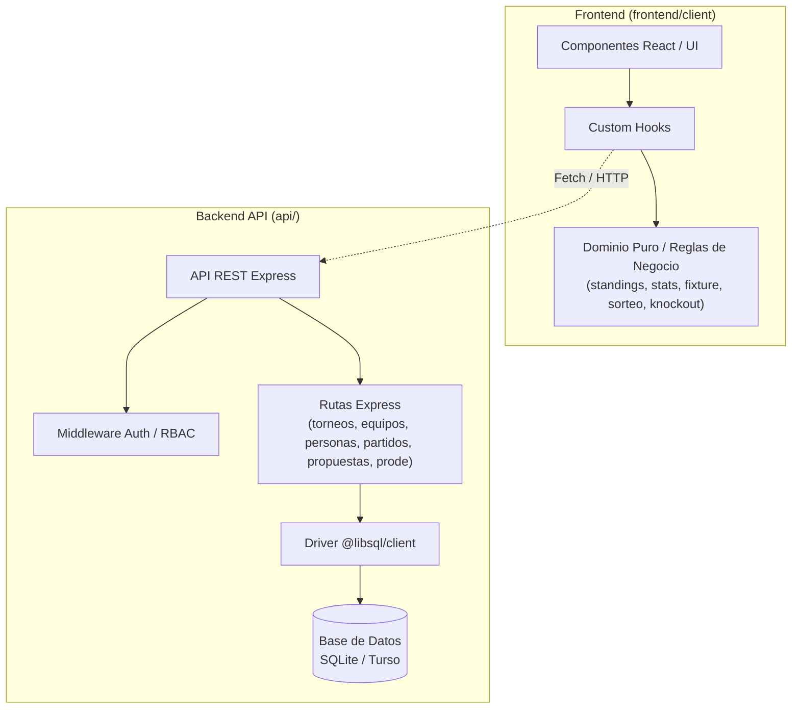

# Regional T — Manager

Sistema de gestión para ligas y torneos de fútbol (ej. PES 2006 y torneos locales). Permite administrar planteles, fixtures, moderación comunitaria de resultados, cómputo automático de posiciones, estadísticas y módulo de pronósticos deportivos (Prode).

---

## 🚀 Características Principales

- **Gestión de Torneos Multiformato:** Soporte para formatos de liga (ida, ida y vuelta) y fases eliminatorias directas (*playoffs*).
- **Control de Acceso y Roles (RBAC):** Autenticación mediante JWT con roles de administrador y usuario estándar, incluyendo gestión de perfiles y avatares.
- **Carga Colaborativa y Moderación:** Envío de propuestas de resultados por parte de los jugadores, con panel de moderación y aprobación para organizadores.
- **Estadísticas en Tiempo Real:** Tabla de posiciones, tabla de goleadores y registro de tarjetas con actualización automática.
- **Módulo de Prode:** Sistema de pronósticos con puntuación automática y tabla de líderes por torneo y global.

---

## 📐 Arquitectura

El proyecto está diseñado bajo principios de desacoplamiento y **Clean Architecture**:



### Stack Tecnológico

| Capa | Tecnologías | Enfoque |
| :--- | :--- | :--- |
| **Frontend** | React 19, TypeScript, Vite, Tailwind/CSS | Lógica de dominio pura desacoplada de la interfaz (`src/domain/`). |
| **Backend** | Node.js (ESM), Express 4, LibSQL (`@libsql/client`) | API REST con soporte para SQLite local y Turso DB en la nube. |
| **Seguridad** | JWT (`jsonwebtoken`), Bcrypt (`bcryptjs`), Cookies HttpOnly | Sesiones seguras y control de acceso basado en roles. |
| **Testing** | Node.js Test Runner nativo (`node --test`) | Pruebas unitarias de dominio y pruebas de integración de API. |

---

## 🗂️ Estructura del Repositorio

```text
.
├── api/                  # Backend REST (Node.js + Express + LibSQL)
│   ├── src/              # Rutas, controladores, middleware y conexión a base de datos
│   ├── test/             # Pruebas de integración de la API
│   ├── schema.sql        # Definición relacional de tablas
│   └── package.json      # Dependencias y scripts del backend
│
├── frontend/
│   └── client/           # SPA cliente (React 19 + TypeScript + Vite)
│       ├── src/
│       │   ├── domain/   # Capa de dominio pura (lógica agnóstica de UI y tests unitarios)
│       │   ├── hooks/    # Custom hooks para integración con React
│       │   ├── components/# Componentes visuales y vistas
│       │   └── services/ # Clientes de consumo HTTP
│       └── package.json  # Dependencias y scripts del frontend
│
├── docs/                 # Documentación técnica complementaria y planes de diseño
├── package.json          # Configuración de workspaces y scripts raíz
└── vercel.json           # Configuración de despliegue en Vercel
```

---

## 🛠️ Puesta en Marcha (Desarrollo Local)

### 1. Requisitos Previos

- **Node.js**: Versión 20 o superior.
- **npm** o **pnpm**.

### 2. Instalación y Configuración

1. Clonar el repositorio e instalar las dependencias de todos los paquetes:
   ```bash
   npm install
   ```

2. Configurar las variables de entorno del backend:
   ```bash
   cp api/.env.example api/.env
   ```
   *(Edita `api/.env` si requieres una configuración específica; por defecto utiliza SQLite local en `file:local.db`)*.

3. Inicializar las tablas y datos de la base de datos:
   ```bash
   npm run db:init --prefix api
   ```

### 3. Ejecución

- **Iniciar Frontend (Vite):**
  ```bash
  npm run dev
  ```
  La aplicación estará disponible en `http://localhost:5173`.

- **Iniciar Backend (Express API):** En una terminal separada:
  ```bash
  npm run dev --prefix api
  ```
  La API estará disponible en `http://localhost:3001`.

---

## 🧪 Pruebas y Calidad de Código

El repositorio cuenta con una suite completa de pruebas unitarias y de integración que se ejecutan sin dependencias externas pesadas:

```bash
# Ejecutar todas las pruebas (frontend y backend)
npm test

# Ejecutar únicamente pruebas unitarias de dominio del frontend
npm run test:frontend

# Ejecutar únicamente pruebas de integración de la API
npm run test:api

# Ejecutar el linter (ESLint) en el frontend
npm run lint

# Compilar TypeScript y generar el build de producción
npm run build
```

---

## 🚀 Despliegue

El proyecto está configurado para desplegarse de manera continua en **Vercel** mediante el archivo `vercel.json` en la raíz:
- **Build Command:** `npm run build --prefix frontend/client`
- **Output Directory:** `frontend/client/dist`
- **Framework:** `vite`

---

## 🤝 Colaboración

Las contribuciones son bienvenidas. Para mantener la calidad y consistencia del código:
- Todas las contribuciones deben seguir **Conventional Commits** (ej. `feat: ...`, `fix: ...`, `refactor: ...`).
- La lógica de negocio debe residir en funciones puras dentro de `frontend/client/src/domain/`, garantizando su cobertura de pruebas.
- Consulta [CONTRIBUTING.md](CONTRIBUTING.md) para conocer las directrices completas de flujo de trabajo, creación de ramas y pull requests.
